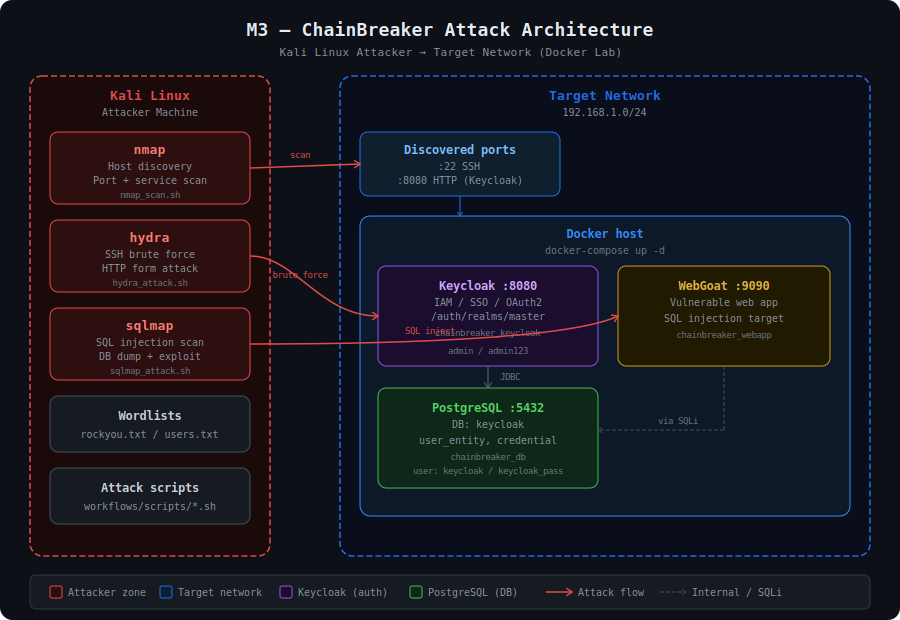

# M3 — ChainBreaker Attack Module

> **Branch:** `attacker` | **Member:** 3 — Attacker role

---

## Overview

This branch contains all **offensive security scripts and tooling** for the M3 attack module of the ChainBreaker project. The goal is to simulate a real-world attack chain against a Keycloak-based identity server and a vulnerable web application running in Docker.

---

## Architecture



**Attack chain:**
```
Kali Linux (attacker)
  │
  ├── nmap ──────────► Host discovery + port scan + service ID
  │
  ├── hydra ─────────► Brute force SSH :22 + Keycloak :8080
  │
  └── sqlmap ────────► SQL injection on WebGoat :9090 → dump PostgreSQL
```

---

## Repository Structure

```
Chain-Breaker/attacker
├── docker/
│   └── docker-compose.yml     # Keycloak + PostgreSQL + WebGoat lab
├── docs/
│   └── attack_architecture.svg  # Full architecture diagram
├── workflows/
│   └── scripts/
│       ├── nmap_scan.sh       # Phase 1 — Recon
│       ├── hydra_attack.sh    # Phase 2 — Brute force
│       └── sqlmap_attack.sh   # Phase 3 — SQL injection
└── README.md
```

---

## Quick Start

### 1. Deploy the target lab

```bash
cd docker/
docker-compose up -d

# Verify containers are running
docker-compose ps
docker logs chainbreaker_keycloak --tail 30
```

Access points once running:

| Service    | URL                        | Credentials         |
|------------|----------------------------|---------------------|
| Keycloak   | http://localhost:8080      | admin / admin123    |
| WebGoat    | http://localhost:9090      | guest / guest       |
| PostgreSQL | localhost:5432             | keycloak / keycloak_pass |

---

### 2. Run the attack scripts

Make all scripts executable:

```bash
chmod +x workflows/scripts/*.sh
```

#### Phase 1 — nmap recon

```bash
./workflows/scripts/nmap_scan.sh 192.168.1.0/24
```

Output saved to `./nmap_results/`

#### Phase 2 — hydra brute force

```bash
./workflows/scripts/hydra_attack.sh 192.168.1.100
```

Output saved to `./hydra_results/`

#### Phase 3 — sqlmap injection

```bash
./workflows/scripts/sqlmap_attack.sh 192.168.1.100 9090
```

Output saved to `./sqlmap_results/`

---

## Tools Used

| Tool     | Purpose                        | Install                          |
|----------|--------------------------------|----------------------------------|
| nmap     | Network recon                  | `sudo apt install nmap`          |
| hydra    | Credential brute force         | `sudo apt install hydra`         |
| sqlmap   | SQL injection automation       | `sudo apt install sqlmap`        |
| docker   | Deploy target lab              | `sudo apt install docker-compose`|

Install all at once:

```bash
sudo apt update && sudo apt install -y nmap hydra sqlmap docker.io docker-compose
```

---

## Key PostgreSQL Tables (Keycloak)

| Table           | Contains                          |
|-----------------|-----------------------------------|
| `user_entity`   | All user accounts                 |
| `credential`    | Hashed passwords                  |
| `realm`         | Realm configuration               |
| `client`        | OAuth2 client apps                |
| `user_session`  | Active sessions                   |

```bash
# Connect directly to PostgreSQL
docker exec -it chainbreaker_db psql -U keycloak -d keycloak

# Dump all users
SELECT username, email, enabled FROM user_entity;

# Dump credentials
SELECT user_id, type, secret_data FROM credential;
```

---

> ⚠️ **Legal notice:** These tools and scripts are for use only in authorized lab environments. Do not use against systems you do not own or have explicit written permission to test.
